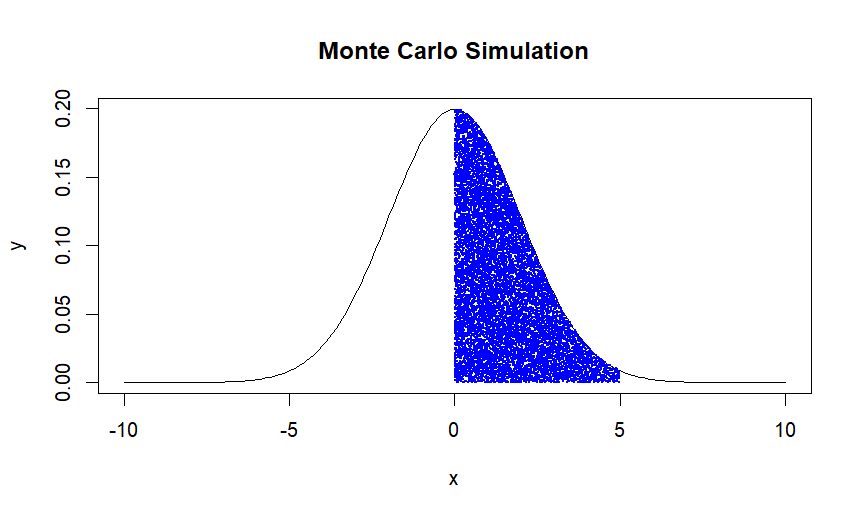

# Monte Carlo Simulation in R

## Overview
This project implements a **Monte Carlo Simulation** to estimate the **area under any given function** between two user-defined points. The estimated area is then compared with the actual area computed using probability functions. A visualization of the estimation process is also included.

## Features
- Allows the user to **input two points (x1, x2)** to define the integration range.
- Uses **Monte Carlo methods** to estimate the area under the normal distribution curve.
- Generates **random points** and visualizes which points fall under the curve.
- Compares the estimated area with the **true probability** computed using the normal distribution.
- Plots the **development of the estimator** using `plot`.

## How to Run
1. Install R and RStudio if you haven’t already.
2. Install necessary packages (if not already installed):
   ```r
   install.packages("dplyr")
   ```
3. Clone this repository:
   ```sh
   git clone https://github.com/dean295546/monte-carlo-simulation.git
   ```
4. Open `monte_carlo_simulation.R` in RStudio.
5. Run the script and enter the required input values when prompted.

## Example Output
When the script is executed, it generates:
- A **normal distribution curve** with scattered points.
- A **highlighted section** representing the estimated area under the curve.
- A numerical comparison between the **Monte Carlo estimate** and the **actual probability**.

For example, when I entered `0` for `x1` and `5` for `x2`, the results were:
```
[1] "The estimated probability is: 0.496366975407218"
[1] "The real probability is:  0.493790334674224"
```

  
_(Example plot generated from the simulation)_

## About This Project
This is a **student project** I completed during my master's studies to practice **probability estimation, Monte Carlo methods, and data visualization in R**.

## Author
Dean

